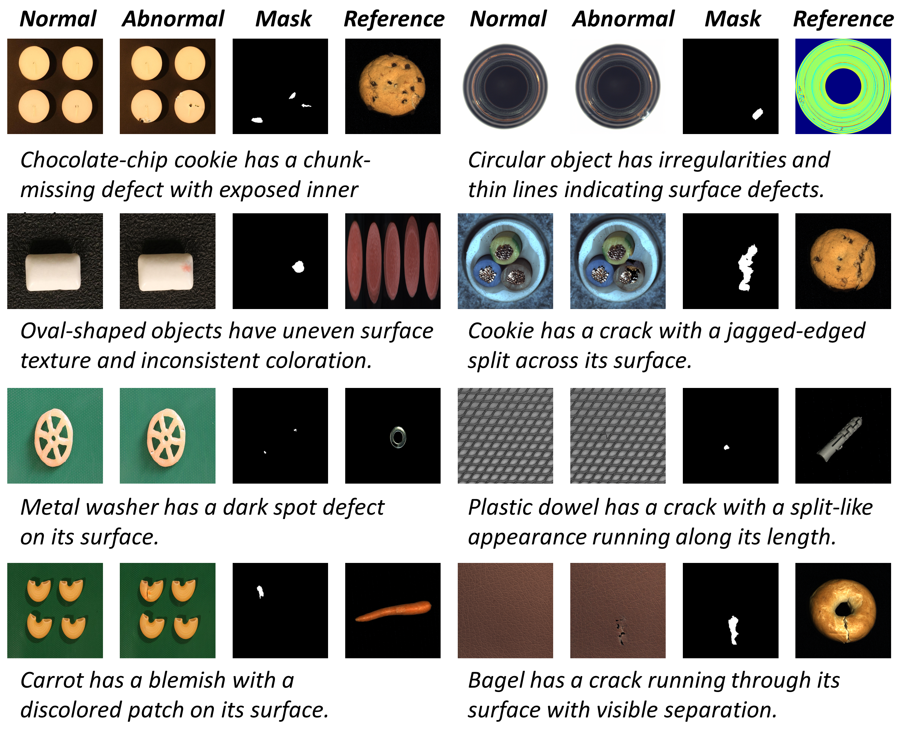
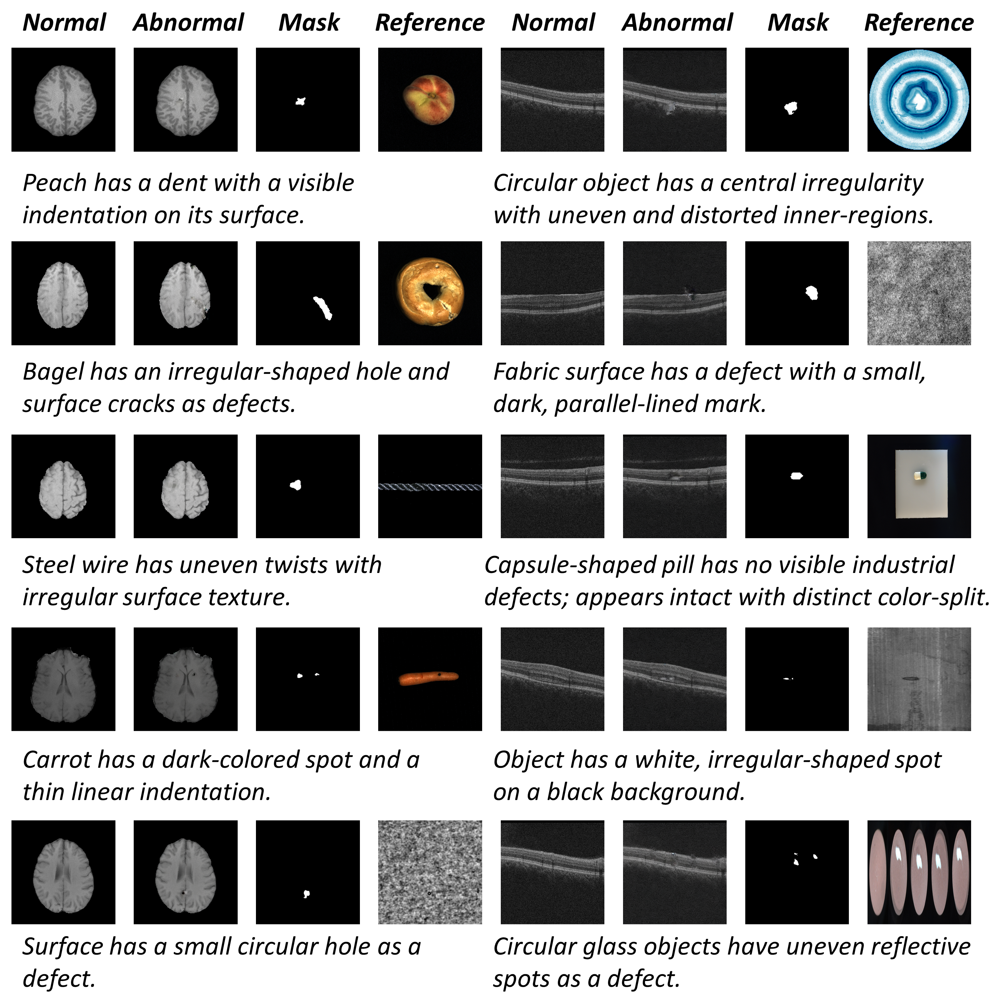
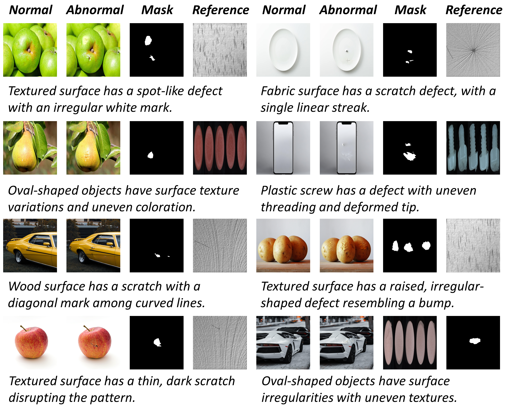

<div align="left">
<br>
<br>
</div>
<div align="center">
<h1>[AAAI 2026] Anomagic: Crossmodal Prompt-driven Zero-shot Anomaly Generation</h1>
<div>
&nbsp;&nbsp;&nbsp;&nbsp;<a href='https://github.com/yuxin-jiang' target='_blank'>Yuxin Jiang</a><sup>1</sup>&emsp;
&nbsp;&nbsp;&nbsp;&nbsp;<a href='https://github.com/wei-luo-tsinghua' target='_blank'>Wei Luo</a><sup>3</sup>&emsp;
&nbsp;&nbsp;&nbsp;&nbsp;<a href='https://github.com/hui-zhang-cas' target='_blank'>Hui Zhang</a><sup>2</sup>&emsp;
&nbsp;&nbsp;&nbsp;&nbsp;<a href='https://github.com/qiyu-chen-ia' target='_blank'>Qiyu Chen</a><sup>4</sup>&emsp;
&nbsp;&nbsp;&nbsp;&nbsp;<a href='https://github.com/haiming-yao-tsinghua' target='_blank'>Haiming Yao</a><sup>3</sup>&emsp;
&nbsp;&nbsp;&nbsp;&nbsp;<a href='https://wshen.ieee.org/' target='_blank'>Weiming Shen</a><sup>1, *</sup>&emsp;
&nbsp;&nbsp;&nbsp;&nbsp;<a href='https://caoyunkang.github.io/' target='_blank'>Yunkang Cao</a><sup>2, *</sup>
</div>
<div>
&nbsp;&nbsp;&nbsp;&nbsp;<sup>1</sup>Huazhong University of Science and Technology, &nbsp;&nbsp;&nbsp;&nbsp;<sup>2</sup>Hunan University, &nbsp;&nbsp;&nbsp;&nbsp;<sup>3</sup>Tsinghua University
&nbsp;&nbsp;&nbsp;&nbsp;<sup>4</sup>Institute of Automation, Chinese Academy of Sciences
</div>

[//]: # (<div>)
[//]: # (    <h4 align="center">)
[//]: # (        • <a href="https://arxiv.org/pdf/2406.01078" target='_blank'>CVPR 2025</a> •)
[//]: # (    </h4>)
[//]: # (</div>)

[[Hugging Face Dataset]](https://huggingface.co/datasets/yuxinjiang11/AnomVerse)  [[Project Page]](https://yuxin-jiang.github.io/Anomagic) [[Paper]](https://arxiv.org/abs/2501.12345) [[HuggingFace Demo (coming soon)]](https://huggingface.co/spaces/yuxin-jiang/Anomagic)


[//]: # (<div style="text-align:center">)

[//]: # ()

[//]: # (</div>)

---

</div>

>**Abstract:** We propose **Anomagic**, a zero-shot anomaly generation method that produces semantically coherent anomalies without requiring any exemplar anomalies. By unifying both visual and textual cues through a crossmodal prompt encoding scheme, Anomagic leverages rich contextual information to steer an inpainting‐based generation pipeline. A subsequent contrastive refinement strategy enforces precise alignment between synthesized anomalies and their masks, thereby bolstering downstream anomaly detection accuracy. To facilitate training, we introduce AnomagicDataset, a collection of 12,987 anomaly–mask–caption triplets assembled from 13 publicly available datasets, where captions are automatically generated by multimodal large language models using structured visual prompts and template‐based textual hints. Extensive experiments demonstrate that Anomagic trained on AnomagicDataset can synthesize more realistic and varied anomalies than prior methods, yielding superior improvements in downstream anomaly detection. Furthermore, Anomagic can generate anomalies for any normal‐category image using user‐defined prompts, establishing a versatile foundation model for anomaly generation.


## 💻 Requirements
- Python 3.8.20
- CUDA 11.6+

## 🛠️ Installation
```bash
conda env create -f env.yml
```
Activate the environment:
```bash
conda activate Anomagic
```
## Download Models

You can download the required pretrained models from [here](https://huggingface.co/h94/IP-Adapter). To run the training script, you should also download the following models and place them in the specified directories:

- **IP-Adapter weights** (`ip-adapter_sd15.bin`): Place in the `models/` folder.
- **Image Encoder weights** (`model.safetensors and pytorch_model.bin`): Place in the `models/image_encoder/` folder.
- **Checkpoints**: (`longclip-B.pt and longclip-L.pt`): Place in the `checkpoints/` folder.

## 🚀 Workflow
Follow these steps to prepare data, train models, and generate synthetic anomaly images. The pipeline is designed for VisA and MVTec datasets.

### 1. Dataset JSON Generation
Generate JSON files for labeling datasets in the `label/` folder:
- `label-single/`: For individual datasets.
Run the appropriate script to create structured JSON files with image paths, masks, and metadata.

**Note:** The `label-all/` folder (for all datasets combined) should be generated after completing step 2, once the text prompts are available. Run the appropriate script at that point to create structured JSON files incorporating the prompts, along with image paths, masks, and metadata.

### 2. Generate Text Prompts Using Doubao
Use Doubao (a text generation tool) to create descriptive prompts for given defect data. Outputs are saved in the `doubao/` folder:
- `doubao.py`: Basic version for raw text prompts.
- `doubao-annotated.py`: Annotates anomaly regions with red bounding boxes in images.
- `doubao-cropper.py`: Generates cropped images focusing on anomalies.

These prompts will guide the anomaly synthesis during generation.

### 3. Training with Anomagic_train.py
Train the Anomagic model using the prepared JSON data:
```bash
python Anomagic_train.py \
    --data_json_file /path/to/your/dataset.json \
    --output_dir /path/to/output/weights
```
- `--data_json_file`: Path to the JSON file from Step 1, specifying training images.
- `--output_dir`: Directory to save trained weights.

After training, process the weights using the two `.py` files in the `weight/` folder (e.g., for checkpoint conversion or fine-tuning).

### 4. Similarity Judgment for References
Find similar images as references using `similarity_judgment_visa.py` in the `doubao/` folder:
```bash
python doubao/similarity_judgment_visa.py \
    --input_dir /path/to/defect_images \
    --output_json /path/to/similarity_results.json
```
This generates a JSON file (`similarity_results.json`) mapping defects to similar reference images across datasets.

### 5. Generate Masks for Defects
Create corresponding masks for defects:
- Apply `mvtec.json` or `mvtec_range_visa.json`.
- Run `creatMask.py`:
```bash
python creatMask.py \
    --config_json /path/to/mvtec.json \
    --output_dir /path/to/masks
```
Masks are saved in the specified directory for use in generation.

### 6. Anomaly Generation with Anomagic_test.py
Generate synthetic anomaly images using the trained weights and references:
```bash
python Anomagic_test.py \
    --ip_ckpt /path/to/trained/weights/ip_adapter.bin \
    --similarity_results /path/to/similarity_results.json \
    --normal_images_dir /path/to/normal_images \
    --mask_base /path/to/generated/masks \
    --output_base /path/to/generated/anomalies
```
- `--ip_ckpt`: Path to the trained Anomagic checkpoint.
- `--similarity_results`: JSON from Step 4.
- `--normal_images_dir`: Directory of normal images to inject anomalies into.
- `--mask_base`: Path to masks from Step 5.
- `--output_base`: Directory for generated anomaly images, masks, and overlays.

The script applies quality control (e.g., MetaUAS scores) and saves results in a structured folder (e.g., `abnormal_images/`, `masks_1/`, `mask_overlays/`).

## 🖼️ Anomaly Inference

Our pipeline generates high-fidelity synthetic anomaly images across diverse categories, including industrial datasets (VisA, MVTecAD), medical imaging (BraTS [deVerdier et al. 2024], OCT [Kermany et al. 2018]), and web-crawled images for real-world objects. Below are examples of synthesized images from each category, demonstrating localized anomalies with quality masks.

### Industrial Datasets (VisA & MVTecAD)
Synthesized anomalies on objects like PCBs and capsules, with precise defect localization.

  

### Medical Imaging
Anomalies in brain tumors (BraTS) and retinal scans (OCT), preserving anatomical fidelity.

  
*BraTS and OCT [deVerdier et al. 2024, Kermany et al. 2018]: Brain MRI and Retinal OCT with enhanced tumor region*

### Web-Crawled Real-World Objects
Diverse everyday items with realistic anomalies, sourced from web images.

  

## 💌 Acknowledgement

Our generation pipeline is based on the [🤗Diffusers](https://github.com/huggingface/diffusers) library, incorporating implementations from [IP-Adapter](https://github.com/tencent-ailab/IP-Adapter).

Big thanks to these amazing open-source works!


## 📝 Citation
If you find our work useful in your research, please consider citing our paper:

```
@article{jiang2025anomagic,
  title={Anomagic: Crossmodal Prompt-driven Zero-shot Anomaly Generation},
  author={Jiang, Yuxin and Luo, Wei and Zhang, Hui and Chen, Qiyu and Yao, Haiming and Shen, Weiming and Cao, Yunkang},
  journal={arXiv preprint arXiv:2511.10020},
  year={2025}
}
```
